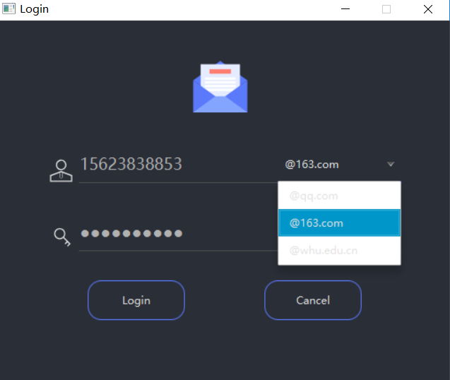
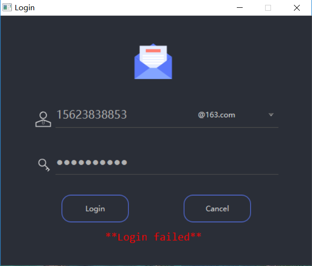
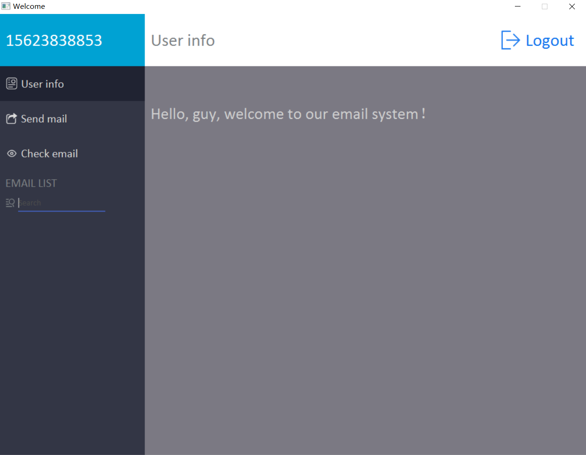
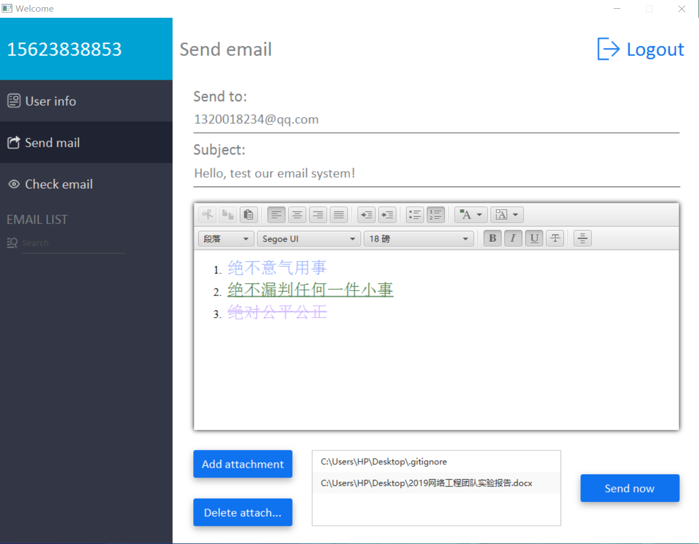
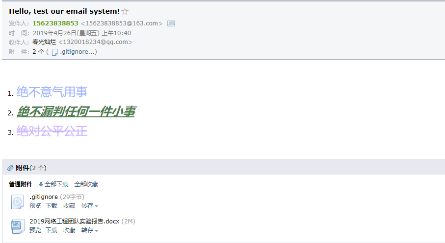
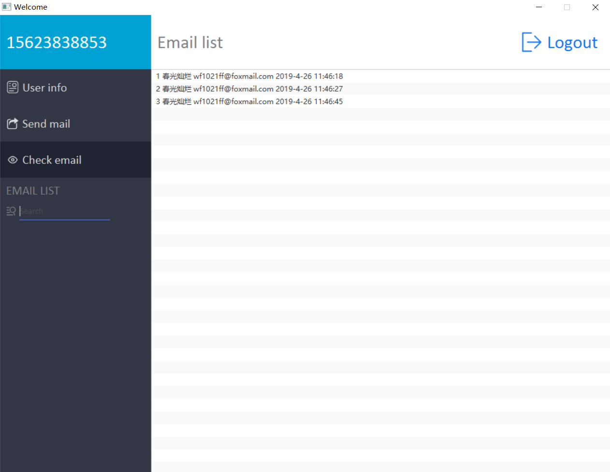
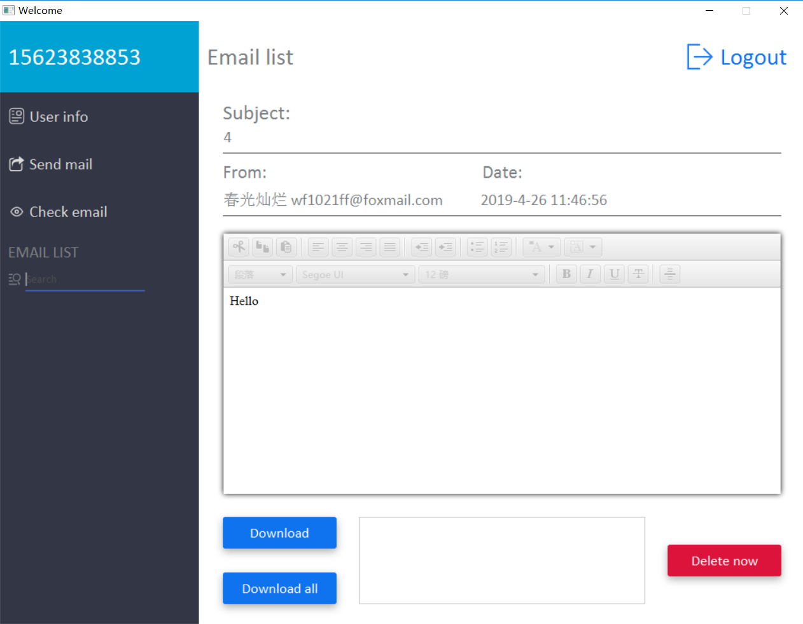

# EmailClient
Email system, based on Javafx and socket programming.
***
The functions supported:
##### 1. Login check.

##### 2. Send email, supporting HTML format and attachments.

##### 3. Look up email and delete email, but not support downloading attachments.

